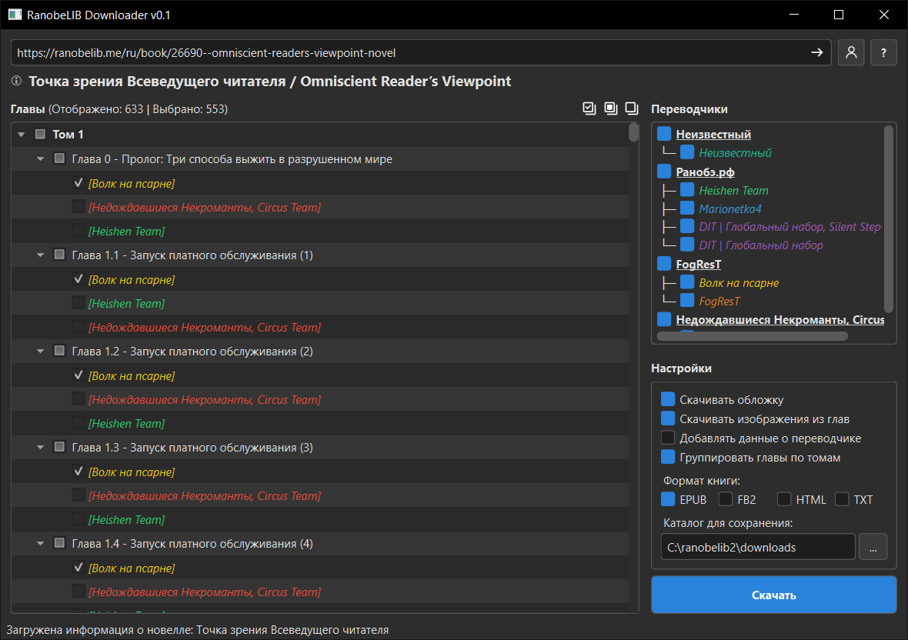
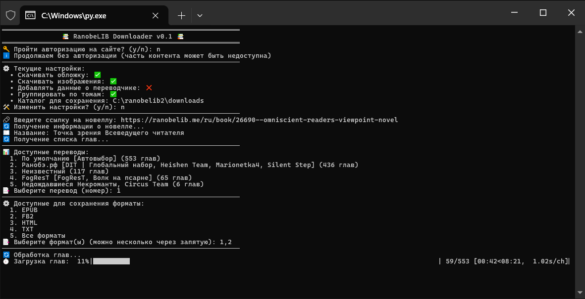

# RanobeLIB Downloader

Программа для скачивания и конвертации новелл с сайта [RanobeLIB.me](https://ranobelib.me) в форматы EPUB, FB2, HTML и TXT.

## Возможности

- 📚 Скачивание новелл с сайта RanobeLIB.me
- 🔐 Вход в аккаунт для доступа к контенту, требующему авторизации
- 📱 Сохранение в форматы EPUB, FB2, HTML, TXT
- 🖼️ Загрузка изображений и обложек
- 🧩 Группировка глав по томам
- 💻 Два интерфейса: графический (GUI) и консольный (CLI)

## Скриншоты

### Графический интерфейс



### Консольный интерфейс



## Требования

- Python 3.10 или выше
- Установленные зависимости из файла `requirements.txt`

## Установка

1. Клонировать репозиторий:
   ```bash
   git clone https://github.com/zeroma25/ranobelib-downloader.git
   cd ranobelib-downloader
   ```

2. Установить зависимости:
   ```bash
   pip install -r requirements.txt
   ```

## Использование

### Графический интерфейс

Запустите программу с графическим интерфейсом:

```bash
python gui.py
```

1. Вставьте URL новеллы в поле ввода
2. Нажмите кнопку "Загрузить"
3. Выберите ветку перевода и главы
4. Настройте параметры скачивания (форматы, директория)
5. Нажмите кнопку "Скачать"

### Консольный интерфейс

Запустите программу в консольном режиме:

```bash
python cli.py
```

1. Следуйте инструкциям в консоли
2. Введите URL новеллы
3. Выберите ветку перевода
4. Выберите форматы для скачивания
5. Дождитесь завершения скачивания

## Настройки

- **Скачивать обложку**: включает/отключает загрузку обложки новеллы
- **Скачивать изображения**: включает/отключает загрузку изображений из глав
- **Добавлять данные о переводчике**: добавляет информацию о команде переводчиков в главы
- **Группировать по томам**: объединяет главы в тома в структуре книги

## Структура проекта

- `cli.py` - точка входа для консольной версии
- `gui.py` - точка входа для графической версии
- `src/` - исходный код программы
  - `api.py` - работа с API
  - `auth.py` - авторизация на сайте
  - `creators/` - создание различных форматов книг
  - `gui/` - компоненты графического интерфейса
  - `img.py` - обработка изображений
  - `parser.py` - парсинг контента
  - `processing.py` - обработка данных
  - `settings.py` - управление настройками

## Лицензия

MIT License